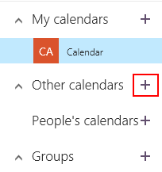
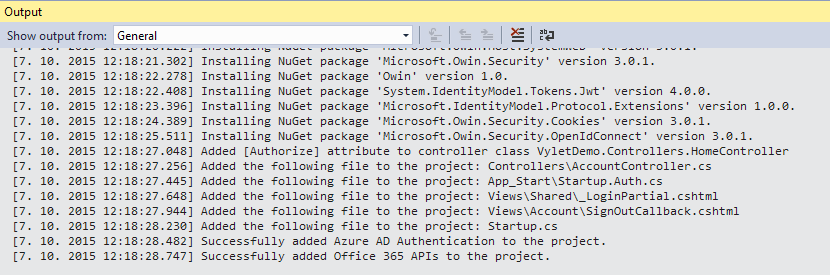

Office 365 API a ASP.NET MVC
===

Tento postup vás provede tvorbou aplikace ASP.NET MVC, která přečte konkrétní kalendář Office 365 a umožní zkopírovat vybranou událost do kalendáře uživatele.

## Příprava
Aby příklad fungoval, musí v Office 365 existovat kalendář, který se jmenuje `Vylety` a je přístupný přihlášenému uživateli. Pro potřeby této ukázky ho vytvoříme jednoduše jako Other calendar.

1. Přihlašte se na https://outlook.office365.com.
1. Klikněte na nabídku vlevo nahoře a zvolte kalendář.

	
	
1. Najeďte myší nad **Other calendars** a klikněte na tlačítko **+**, které se objeví.

	

1. Pojmenujte kalendář **Vylety** (přesně, název se pak používá v kódu).

	

## Nový projekt ASP.NET MVC
1. Spusťte Visual Studio a vyberte **Nový projekt -> Web -> MVC**.
	
	
	
1. Klikněte na **Authentication**, přepněte na **No authentication** a potvrďte **OK**. Autentizaci budeme implementovat vlastními silami.
	
	

## Přidání Office 365 API
1. Klikněte pravým tlačítkem na projekt a vyberte **Add -> Connected Service**.

	
	
1. Zvolte **Office 365 APIs**.

	
	
1. Vyplňte doménu svého tenantu (*.onmicrosoft.com).

	
	
1. Přihlašte se účtem administrátora Office 365 (`[jmeno]@[tenant].onmicrosoft.com`).
1. Ponechte nastavení na **vytvoření nové aplikace v AD** a zaškrtněte **Single Sign-On**.

	
	
1. V Calendar zaškrtněte **Read and write to your calendars**.

	
	
1. V Users and Groups už je zaškrnutno **Sign you in and read your profile**. Další nastavení opránění nebudeme potřebovat.

	
	
1. Klikněte na **Finish** - přidají se NuGety a soubory potřebné pro autentizaci k dané organizaci.
	
	
	
	

## Co se vytvořilo
1. Otevřeme **web.config**.

	```xml
	<appSettings>
		<add key="webpages:Version" value="3.0.0.0" />
		<add key="webpages:Enabled" value="false" />
		<add key="ClientValidationEnabled" value="true" />
		<add key="UnobtrusiveJavaScriptEnabled" value="true" />
		<add key="ida:ClientId" value="XXX" />
		<add key="ida:ClientSecret" value="XXX" />
		<add key="ida:TenantId" value="XXX" />
		<add key="ida:Domain" value="XXX.onmicrosoft.com" />
		<add key="ida:AADInstance" value="https://login.microsoftonline.com/" />
		<add key="ida:PostLogoutRedirectUri" value="https://localhost:44300/" />
	</appSettings>
	```
1. Nové jsou hodnoty `ClientId`, `ClientSecret`, `TenantId`, `Domain`, `AADInstance` a `PostLogoutRedirectUri`, které pocházejí z Azure Active Directory.

1. Podíváme se, odkud se hodnoty berou.
	1. Otevřeme https://manage.windowsazure.com a přihlásíme se účtem Office 365.
	1. Přejdeme na **Active Directory** a zvolíme directory Office 365.
	1. V seznamu najdeme svou aplikaci (v tomto případě **VyletDemo**, ale u vás se může jmenovat jinak - záleží na tom, jak jste pojmenovali projekt). Pokud tam není, je potřeba přepnout nahoře na *Application my company owns*.
	
			
		
	1. Otevřeme ji a přejdeme na **CONFIGURE**.
	1. Jsou tam všechny informace, které pro nás vytvořilo Visual Studio a přidalo je do web.config.
	
		
	
## Přihlašování
Pro ukládání přihlašovacích tokenů se použije lokální SQL databáze. Při přechodu na Azure by bylo potřeba ji přesměrovat na SQL Azure.

1. V Solution Exploreru klikneme pravým tlačítkem na složku **App_Data** a zvolíme **Add &rarr; New item**.
1. Vybereme **Data** &rarr; **SQL Server Database** a pojmenujeme ji **ADALTokenCacheDb.mdf**.

	
	
1. Klikneme na projekt pravým tlačítkem, zvolíme Manage NuGet Packages a nainstalujeme **EntityFramework**.

	
	
1. Do web.config, sekce `configuration`, přidáme následující sekci (pokud tam automaticky nevznikla):

	```xml
	<connectionStrings>
		<add name="DefaultConnection" connectionString="Data Source=(LocalDB)\MSSQLLocalDB;AttachDbFilename=|DataDirectory|\ADALTokenCacheDb.mdf;Integrated Security=True" providerName="System.Data.SqlClient" />
	</connectionStrings>
	```

1. Vytvoříme databázový kontext aplikace. Ve složce Models založíme nový soubor **ApplicationDbContext.cs** a naplníme ho tímto kódem:

	```csharp
	using System;
	using System.ComponentModel.DataAnnotations;
	using System.Data.Entity;
	
	namespace VyletDemo.Models
	{
		public class ApplicationDbContext : DbContext
		{
			public ApplicationDbContext() : base("DefaultConnection") { }
	
			public DbSet<UserTokenCache> UserTokenCacheList { get; set; }
		}
	
		public class UserTokenCache
		{
			[Key]
			public int UserTokenCacheId { get; set; }
			public string webUserUniqueId { get; set; }
			public byte[] cacheBits { get; set; }
			public DateTime LastWrite { get; set; }
		}
	}
	```

1. Ve složce Models vytvoříme i cache na tokeny, coby potomka TokenCache. Vložíme nový soubor s názvem **ADALTokenCache.cs** a naplníme jej takto:

	```csharp
	using Microsoft.IdentityModel.Clients.ActiveDirectory;
	using System;
	using System.Data.Entity;
	using System.Linq;
	
	namespace VyletDemo.Models
	{
		public class ADALTokenCache : TokenCache
		{
			private ApplicationDbContext db = new ApplicationDbContext();
			string User;
			UserTokenCache Cache;
	
			// constructor
			public ADALTokenCache(string user)
			{
				// associate the cache to the current user of the web app
				User = user;
				this.AfterAccess = AfterAccessNotification;
				this.BeforeAccess = BeforeAccessNotification;
				this.BeforeWrite = BeforeWriteNotification;
	
				// look up the entry in the DB
				Cache = db.UserTokenCacheList.FirstOrDefault(c => c.webUserUniqueId == User);
				// place the entry in memory
				this.Deserialize((Cache == null) ? null : Cache.cacheBits);
			}
	
			// clean up the DB
			public override void Clear()
			{
				base.Clear();
				foreach (var cacheEntry in db.UserTokenCacheList)
					db.UserTokenCacheList.Remove(cacheEntry);
				db.SaveChanges();
			}
	
			// Notification raised before ADAL accesses the cache.
			// This is your chance to update the in-memory copy from the DB, if the in-memory version is stale
			void BeforeAccessNotification(TokenCacheNotificationArgs args)
			{
				if (Cache == null)
				{
					// first time access
					Cache = db.UserTokenCacheList.FirstOrDefault(c => c.webUserUniqueId == User);
				}
				else
				{   // retrieve last write from the DB
					var status = from e in db.UserTokenCacheList
								where (e.webUserUniqueId == User)
								select new
								{
									LastWrite = e.LastWrite
								};
					// if the in-memory copy is older than the persistent copy
					if (status.First().LastWrite > Cache.LastWrite)
					//// read from from storage, update in-memory copy
					{
						Cache = db.UserTokenCacheList.FirstOrDefault(c => c.webUserUniqueId == User);
					}
				}
				this.Deserialize((Cache == null) ? null : Cache.cacheBits);
			}
	
			// Notification raised after ADAL accessed the cache.
			// If the HasStateChanged flag is set, ADAL changed the content of the cache
			void AfterAccessNotification(TokenCacheNotificationArgs args)
			{
				// if state changed
				if (this.HasStateChanged)
				{
					Cache = new UserTokenCache
					{
						webUserUniqueId = User,
						cacheBits = this.Serialize(),
						LastWrite = DateTime.Now
					};
					//// update the DB and the lastwrite                
					db.Entry(Cache).State = Cache.UserTokenCacheId == 0 ? EntityState.Added : EntityState.Modified;
					db.SaveChanges();
					this.HasStateChanged = false;
				}
			}
	
			void BeforeWriteNotification(TokenCacheNotificationArgs args)
			{
				// if you want to ensure that no concurrent write take place, use this notification to place a lock on the entry
			}
		}
	}
	```

1. Přidáme SettingsHelper s konstantami Office 365 a načítáním nastavení. V projektu vytvoříme složku **Utils** a vložíme do ní nový soubor **SettingsHelper.cs** s tímto obsahem:

	```csharp
	using System;
	using System.Configuration;
	
	namespace VyletDemo.Utils
	{
		public class SettingsHelper
		{
			private static string _clientId = ConfigurationManager.AppSettings["ida:ClientId"] ?? ConfigurationManager.AppSettings["ida:ClientID"];
			private static string _appKey = ConfigurationManager.AppSettings["ida:ClientSecret"] ?? ConfigurationManager.AppSettings["ida:AppKey"] ?? ConfigurationManager.AppSettings["ida:Password"];
	
			private static string _tenantId = ConfigurationManager.AppSettings["ida:TenantId"];
			private static string _authorizationUri = "https://login.windows.net";
			private static string _authority = "https://login.windows.net/{0}/";
	
			private static string _graphResourceId = "https://graph.windows.net";
			private static string _discoverySvcResourceId = "https://api.office.com/discovery/";
			private static string _discoverySvcEndpointUri = "https://api.office.com/discovery/v1.0/me/";
	
			public static string ClientId
			{
				get
				{
					return _clientId;
				}
			}
	
			public static string AppKey
			{
				get
				{
					return _appKey;
				}
			}
	
			public static string TenantId
			{
				get
				{
					return _tenantId;
				}
			}
	
			public static string AuthorizationUri
			{
				get
				{
					return _authorizationUri;
				}
			}
	
			public static string Authority
			{
				get
				{
					return String.Format(_authority, _tenantId);
				}
			}
	
			public static string AADGraphResourceId
			{
				get
				{
					return _graphResourceId;
				}
			}
	
			public static string DiscoveryServiceResourceId
			{
				get
				{
					return _discoverySvcResourceId;
				}
			}
	
			public static Uri DiscoveryServiceEndpointUri
			{
				get
				{
					return new Uri(_discoverySvcEndpointUri);
				}
			}
		}
	}
	```	

1. **App_Start\\Startup.Auth.cs** a úprava autorizace (programujeme si sami pomocí OWIN). Metoda ConfigureAuth:

	```csharp
	public void ConfigureAuth(IAppBuilder app)
	{
		app.SetDefaultSignInAsAuthenticationType(CookieAuthenticationDefaults.AuthenticationType);
	
		app.UseCookieAuthentication(new CookieAuthenticationOptions());
	
		app.UseOpenIdConnectAuthentication(
			new OpenIdConnectAuthenticationOptions
			{
				ClientId = clientId,
				Authority = authority,
	
				Notifications = new OpenIdConnectAuthenticationNotifications()
				{
					// If there is a code in the OpenID Connect response, redeem it for an access token and refresh token, and store those away.
					AuthorizationCodeReceived = (context) =>
					{
						var code = context.Code;
						ClientCredential credential = new ClientCredential(SettingsHelper.ClientId, SettingsHelper.AppKey);
						String signInUserId = context.AuthenticationTicket.Identity.FindFirst(ClaimTypes.NameIdentifier).Value;
	
						AuthenticationContext authContext = new AuthenticationContext(SettingsHelper.Authority, new ADALTokenCache(signInUserId));
						AuthenticationResult result = authContext.AcquireTokenByAuthorizationCode(code, new Uri(HttpContext.Current.Request.Url.GetLeftPart(UriPartial.Path)), credential, SettingsHelper.AADGraphResourceId);
	
						return Task.FromResult(0);
					},
					RedirectToIdentityProvider = (context) =>
					{
						// This ensures that the address used for sign in and sign out is picked up dynamically from the request
						// this allows you to deploy your app (to Azure Web Sites, for example)without having to change settings
						// Remember that the base URL of the address used here must be provisioned in Azure AD beforehand.
						string appBaseUrl = context.Request.Scheme + "://" + context.Request.Host + context.Request.PathBase;
						context.ProtocolMessage.RedirectUri = appBaseUrl + "/";
						context.ProtocolMessage.PostLogoutRedirectUri = appBaseUrl;
	
						return Task.FromResult(0);
					},
					AuthenticationFailed = (context) =>
					{
						// Suppress the exception if you don't want to see the error
						context.HandleResponse();
						return Task.FromResult(0);
					}
				}
	
			});
	}
	```

1. Nahoru bude nakonec potřeba doplnit usings:

	```csharp
	using Microsoft.IdentityModel.Clients.ActiveDirectory;
	using System.IdentityModel.Claims;
	using VyletDemo.Models;
	using VyletDemo.Utils;
	using System.Threading.Tasks;
	```

## Volání Office 365 API
Budeme načítat události kalendáře, takže si připravíme třídu, která bude událost reprezentovat.

1. Ve složce **Models** vytvoříme nový soubor **MyCalendarEvent.cs** a vložíme do něj:

	```csharp
	using System;
	
	namespace VyletDemo.Models
	{
		public class MyCalendarEvent
		{
			public string Id { get; set; }
			public string Subject { get; set; }
			public string Location { get; set; }
			public DateTimeOffset? Start { get; set; }
			public DateTimeOffset? End { get; set; }
			public string Body { get; set; }
		}
	}
	```

1. Ve složce **Utils** vytvoříme soubor **AuthHelper.cs** a vložíme do něj:

	```csharp
	using Microsoft.IdentityModel.Clients.ActiveDirectory;
	using Microsoft.Office365.Discovery;
	using Microsoft.Office365.OutlookServices;
	using VyletDemo.Models;
	using System.Security.Claims;
	using System.Threading.Tasks;
	
	namespace VyletDemo.Utils
	{
		public class AuthHelper
		{
			async public static Task<OutlookServicesClient> CreateOutlookClientAsync(string capabilityName)
			{
				var signInUserId = ClaimsPrincipal.Current.FindFirst(ClaimTypes.NameIdentifier).Value;
				var userObjectId = ClaimsPrincipal.Current.FindFirst("http://schemas.microsoft.com/identity/claims/objectidentifier").Value;
	
				AuthenticationContext authContext = new AuthenticationContext(SettingsHelper.Authority, new ADALTokenCache(signInUserId));
	
				try
				{
					DiscoveryClient discClient = new DiscoveryClient(SettingsHelper.DiscoveryServiceEndpointUri,
					async () =>
					{
						var authResult = await authContext.AcquireTokenSilentAsync(SettingsHelper.DiscoveryServiceResourceId,
							new ClientCredential(SettingsHelper.ClientId, SettingsHelper.AppKey),
							new UserIdentifier(userObjectId, UserIdentifierType.UniqueId));
	
						return authResult.AccessToken;
					});
	
					var dcr = await discClient.DiscoverCapabilityAsync(capabilityName);
	
					OutlookServicesClient exClient = new OutlookServicesClient(dcr.ServiceEndpointUri,
					async () =>
					{
						var authResult = await authContext.AcquireTokenSilentAsync(dcr.ServiceResourceId, new ClientCredential(SettingsHelper.ClientId, SettingsHelper.AppKey), new UserIdentifier(userObjectId, UserIdentifierType.UniqueId));
	
						return authResult.AccessToken;
					});
	
					return exClient;
				}
				catch (AdalException ex)
				{
					if (ex.ErrorCode == AdalError.FailedToAcquireTokenSilently)
					{
						authContext.TokenCache.Clear();
						throw ex;
					}
					return null;
				}
			}
		}
	}
	```

1. Začneme vytvářet controller, který to všechno rozhýbe.
1. Ve složce **Controllers** zvolíme Add -> Controller a zvolíme **MVC 5 Controller - Empty**.

	
	
1. Pojmenujeme ho **VyletyController** a začneme plnit.

### Index - seznam událostí
Akce Index vypíše seznam eventů, které jsou k dispozici, a nabídne tlačítko pro registraci. Její kompletní zdrojový kód vypadá takto:

```csharp
[Authorize]
async public Task<ActionResult> Index()
{
	List<MyCalendarEvent> myEvents = new List<MyCalendarEvent>();

	OutlookServicesClient outlookClient = await AuthHelper.CreateOutlookClientAsync("Calendar");

	var calendar = await outlookClient.Me.Calendars.Where(c => c.Name == "Vylety").ExecuteSingleAsync();
	string vyletyId = calendar.Id;

	var events = await outlookClient.Me.Calendars.GetById(vyletyId).Events.ExecuteAsync();

	do
	{
		foreach (var ev in events.CurrentPage)
		{
			myEvents.Add(new MyCalendarEvent()
			{
				Id = ev.Id,
				Subject = ev.Subject,
				Start = ev.Start,
				End = ev.End,
				Location = ev.Location.DisplayName,
				Body = ev.Body.Content
			});
		}
		events = await events.GetNextPageAsync();
	} while (events != null);


	return View(myEvents);
}
```

1. Má atribut `[Authorize]`, protože budeme vyžadovat přihlášení.
1. Nejprve připravíme základní kostru - seznam eventů `List<MyCalendarEvent>` a zobrazení view `View(myEvents)`.
1. Potom necháme pomocnou metodu, ať provede nezbytné autentizační kolečko a vrátí nám OutlookClient, který budeme používat k volání API.
1. Následně použijeme OutlookClient k získání ID konkrétního kalendáře (v tomto případě se jmenuje Vylety). Všimněte si, že příkaz je zakončen `ExecuteSingleAsync();`
1. Jakmile máme ID kalendáře, můžeme si sáhnout na události v něm uložené - `GetById(vyletyId).Events`.
1. Nakonec projdeme vrácené události, překlopíme je do vlastního objektu `MyCalendarEvent` a vrátíme v podobě seznamu. Výsledky jsou automaticky stránkované, proto čteme vždy `CurrentPage` a nakonec v cyklu voláme `GetNextPageAsync()`.
1. Přidáme View -> Index -> List

	

1. Odebereme odkaz pro vytváření a odkazy pro správu.
1. Spustíme.

	

1. Do posledního <td> přidáme registrační tlačítko.

	```csharp
	@using (Html.BeginForm("Register", "Vylety"))
	{
		<input type="hidden" name="eventId" value="@item.Id" />
		<input type="submit" value="Register" class="btn btn-primary" />
	}
	```

1. A do controlleru obsluhu akce:

	```csharp
	[HttpPost]
	async public Task<ActionResult> Register(FormCollection collection)
	{
		string eventId = collection["eventId"];
		OutlookServicesClient outlookClient = await AuthHelper.CreateOutlookClientAsync("Calendar");
		var @event = await outlookClient.Me.Events.GetById(eventId).ExecuteAsync();
		Event newEvent = new Event()
		{
			Subject = @event.Subject,
			Start = @event.Start,
			StartTimeZone = @event.StartTimeZone,
			EndTimeZone = @event.EndTimeZone,
			End = @event.End,
			Location = @event.Location,
			Body = @event.Body
		};
	
		await outlookClient.Me.Events.AddEventAsync(newEvent);
		return RedirectToAction("Index");
	}
	```

1. Nakonec ještě přidáme odkaz na výlety do souboru **_Layout.cshtml** ve složce **Views\\Shared**.

	```xml
	<ul class="nav navbar-nav">
		<li>@Html.ActionLink("Home", "Index", "Home")</li>
		<li>@Html.ActionLink("About", "About", "Home")</li>
		<li>@Html.ActionLink("Contact", "Contact", "Home")</li>
		<li>@Html.ActionLink("Výlety", "Index", "Vylety")</li>
	</ul>
	```
	
Hotovo. Aplikace by měla vypadat nějak takhle:

