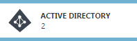
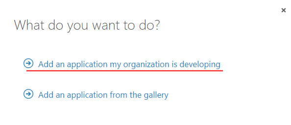
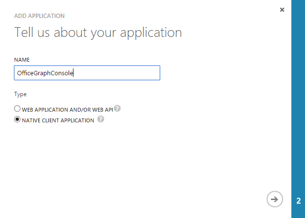
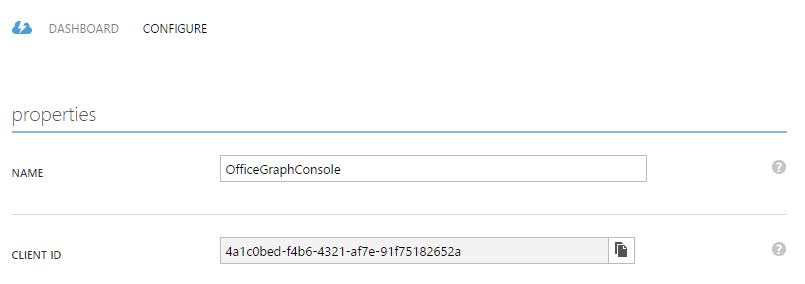
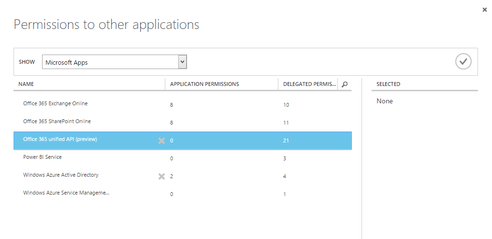
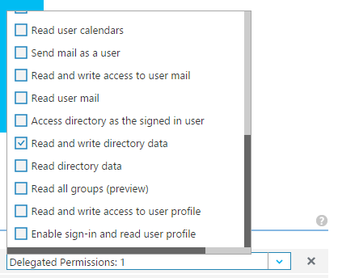
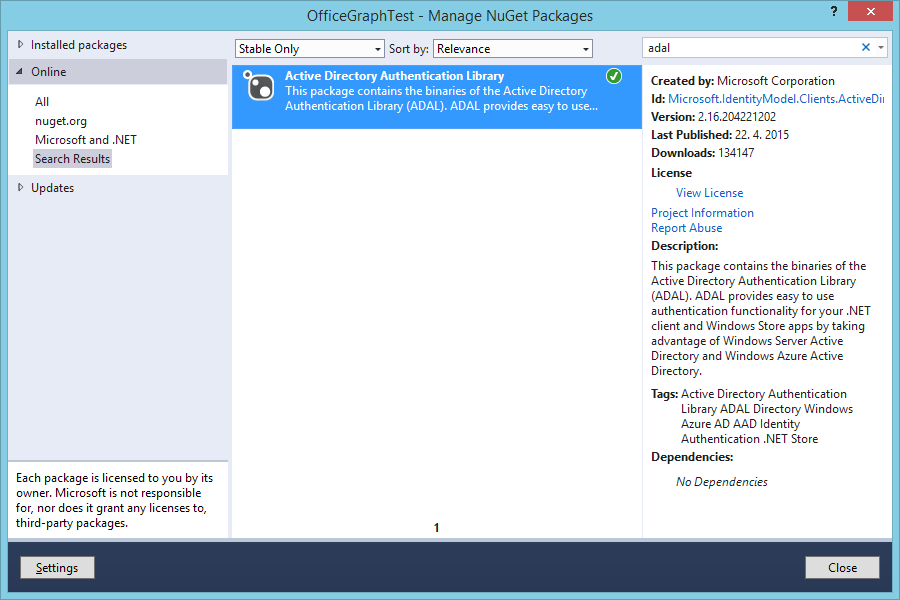
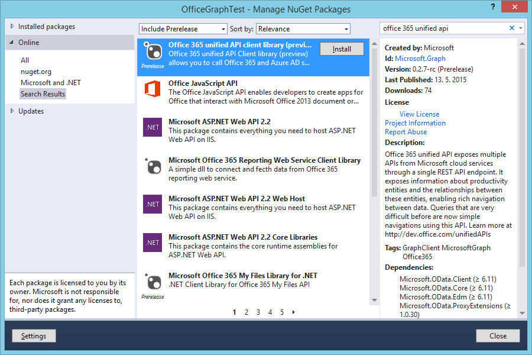
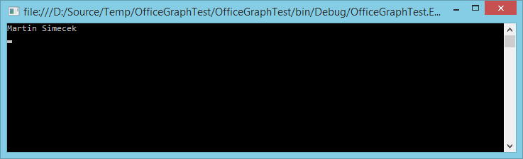

# Konzolová aplikace využívající sjednocené rozhraní Office Graph API
Office 365 API se v blízké budoucnosti dočkají sjednocení rozhraní do podoby tzv. Office 365 Unified API (alias Graph API).

http://dev.office.com/unifiedAPIs


## Registrace v Azure Active Directory
Nejprve je potřeba aplikaci registrovat v Azure Active Directory (AAD) na stávajícím portále.

1. Otevřeme [Azure Management portál](https://manage.windowsazure.com) a přihlásíme se svým účtem.
1. Přejdeme na **Active Directory**.

	
	
1. Zvolíme directory Office 365 a přejdeme na **APPLICATIONS**.
1. Dole klikneme na **ADD** a vybereme **Add an application my organization is developing**.

	

1. Zadáme název aplikace, např. **OfficeGraphConsole** a přepneme na **Native client application**.

	
	
1. V dalším kroku zadáme libovolnou URL (která nemusí existovat, pouze musí být validní), tedy např. `https://localhost/officegraphconsole` a potvrdíme.
1. Jakmile se aplikace přidá do seznamu, vybereme ji a přejdeme na záložku **CONFIGURE**.
1. Odtud si zkopírujeme **CLIENT ID**.

	
	
1. V části **Permissions to other applications** přidáme tlačítkem **Add application** aplikaci **Office 365 Unified API (preview)**.

	
	
1. Nastavíme aplikaci **Delegated permissions** na **Read and write directory data**.

	
	
1. Zároveň ověříme, že **Windows Azure Active Directory** má Delegated permissions na **Enable sign-on and read users' profiles**.
1. Potvrdíme tlačítkem **SAVE**.	

## Konzolová aplikace
Ve Visual Studiu vytvoříme obyčejnou (a značně jednoduchou) konzolovou aplikaci, která přihlásí uživatele a zeptá se API na jeho jméno.

1. Založíme nový projekt: **Windows Desktop -> Console Application** a pojmenujeme ho **OfficeGraphConsole**.
1. Jakmile jej Visual Studio vytvoří, klikneme pravým tlačítkem na projekt a zvolíme **Manage NuGet Packages**.
1. Vyhledáme nejprve _adal_ a zvolíme, že chceme nainstalovat **Active Directory Authentication Library**.

	
	
1. Potom zahrneme do hledání i preview balíčky (**Include Prerelease**) a vyhledáme **Office 365 Unified API....**.

	
    
1. Nahradíme kód aplikace tímto:

    ```csharp
    using Microsoft.Graph;
    using Microsoft.IdentityModel.Clients.ActiveDirectory;
    using System;
    using System.Collections.Generic;
    using System.Linq;
    using System.Text;
    using System.Threading.Tasks;
    
    namespace OfficeGraphConsole
    {
        class Program
        {
            const string tenantId = "<tenant>.onmicrosoft.com";
            const string serviceRoot = "https://graph.microsoft.com/beta/" + tenantId; // graph URL má podobu: https://graph.microsoft.com/{version}/{tenantID}
            const string redirectUri = "https://localhost/officegraphconsole";
            const string authority = "https://login.microsoftonline.com/common";
            const string resource = "https://graph.microsoft.com";
    
    		const string clientId = "<client ID>"; // pochází z Azure Active Directory
            
            static void Main(string[] args)
            {
                GraphService client = new GraphService(new Uri(serviceRoot), () => AcquireTokenForUser());
                IUser user = client.Me.ExecuteAsync().Result;
    
                Console.WriteLine(user.displayName);
                Console.ReadKey();
            }
    
            private static Task<string> AcquireTokenForUser()
            {
                var authenticationContext = new AuthenticationContext(authority, false);
                var userAuthResult = authenticationContext.AcquireToken(resource, clientId, new Uri(redirectUri), PromptBehavior.Auto);
                var tokenForUser = userAuthResult.AccessToken;
    
                return Task.FromResult(tokenForUser);
            }
        }
    }
    
    ```
    
    * `tenantId` označuje konkrétní Office 365 tenant, k němuž se připojujeme.
    * `serviceRoot` je URL společného endpointu Graph API. Jakmile opustí stádium preview, bude _beta_ nahrazeno konkrétní verzí.
    * `resource` reprezentuje zdroj, ke kterému žádáme přístup - v tomto případě samotný Graph, protože z něj chceme číst informace o uživateli.
    
1. Po spuštění si aplikace nejprve vyžádá přihlášení uživatele a následně vypíše jeho jméno.

    
    
Pokud vás zajímá, jak probíhá autentizační flow, můžete odchytit síťovou komunikaci a také se podívat na to, jaké hodnoty se naplňují do objektu `AuthenticationContext` (uvidíte tam např. Access Token a Refresh Token).