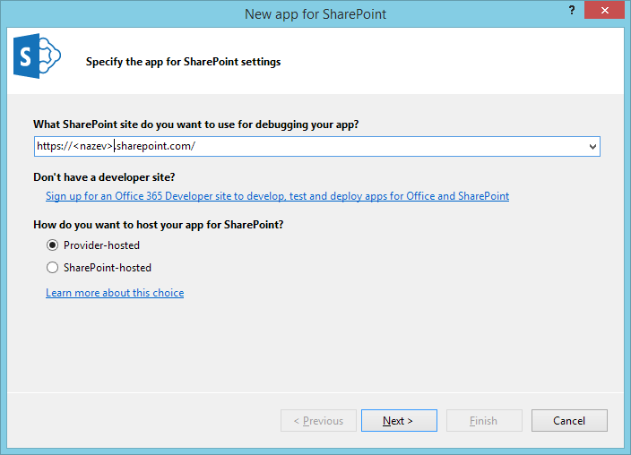

SharePoint Cross-Domain Library
===
## Overview
Tato ukázka vychází z oficiálního Office Dev Campu a rozvíjí lab v modulu 3.

Cílem je vytvoøit **provider-hosted** aplikaci pro SharePoint, která využívá ASP.NET MVC a implementuje obì situace spojené s ```SP.RequestExecutor```:

* volání App Webu
* volání Host Webu

## Cross-Domain Library & App Web
### Vytvoøení nové aplikace ve Visual Studiu 2013
...

## Cross-Domain Library & Host Web

_TODO: vytvoøení seznamu Auta_

Zajímavìjší situace nastává v pøípadì, že chceme pøistupovat na Host Web, tedy mimo naši vlastní aplikaci.

1. Spuste **Visual Studio 2013** jako Administrator.
1. Vyberte **File -> New -> Project**.
1. Zvolte **Templates -> Visual C# -> Office -> SharePoint -> Apps -> App for SharePoint**.
1. **Pojmenujte** projekt podle své libosti a kliknìte na **OK**.
1. Zadejte URL svého developer tenantu, napøíklad **https://martinovo.sharepoint.com**.
1. Vyberte **Provider-hosted** a kliknìte na **Next**.<br />

1. Vyberte **SharePoint Online** a kliknìte na **Next**.<br />
 
1. Vyberte **ASP.NET MVC Web Application** a kliknìte na **Next**.
1. Nechte vybrané **Use Windows Azure Access Control Service** a kliknìte na **Finish**.

Vytvoøí se nová aplikace pøipravená pro nasazení na SharePoint Online.

Nyní ji zaèneme upravovat pro volání pomocí cross-domain library.

1. Otevøete soubor **HomeController.cs** ve složce **Controllers**.
1. Smažte obsah bloku **using** v metodì **Index** a soubor uložte.

1. Kliknìte pravým tlaèítkem na složku **Scripts** a zvolte **Add -> JavaScript File**.
1. Pojmenujte soubor **crossdomain.js** (pøípadnì jakkoliv jinak).
1. Vložte do nìj následující kód:<br />
```javascript
(function () {
        "use strict";

        jQuery(function () {

            var appWebUrl = "";
            var spHostUrl = "";
            var args = window.location.search.substring(1).split("&");

            for (var i = 0; i < args.length; i++) {
                var n = args[i].split("=");
                if (n[0] == "SPHostUrl")
                    spHostUrl = decodeURIComponent(n[1]);
            }

            for (var i = 0; i < args.length; i++) {
                var n = args[i].split("=");
                if (n[0] == "SPAppWebUrl")
                    appWebUrl = decodeURIComponent(n[1]);
            }

            var scriptbase = spHostUrl + "/_layouts/15/";

            jQuery.getScript(scriptbase + "SP.RequestExecutor.js", function (data) {

                //Call Host Web with REST
                var executor = new SP.RequestExecutor(appWebUrl);
                executor.executeAsync({
                    url: appWebUrl + "/_api/SP.AppContextSite(@hostweb)/web/lists/getbytitle('Auta')/items?@hostweb='" + spHostUrl +"'",
                    method: "GET",
                    headers: { "accept": "application/json;odata=verbose" },
                    success: function (data) {

                        var results = JSON.parse(data.body).d.results;
                        for (var i = 0; i < results.length; i++) {
                            $("#carList").append("<li>" + results[i].Title + "</li>");
                        }
                    },
                    error: function () {
                        alert("Error!");
                    }
                });

            });

        });

    }());
```
1. Nyní otevøete view **Index.cshtml** ve složce **Views -> Home** a vložte do nìj následující:

```
@{
    ViewBag.Title = "Home Page";
    Layout = null;
}

<script src="~/Scripts/jquery-1.10.2.min.js"></script>
<script src="~/Scripts/crossdomain.js"></script>

<div>
    <ul id="carList"></ul>
</div>
```
(Pro jednoduchost úplnì obcházíme layoutovací systém ASP.NET MVC a vypisujeme seznam na prázdnou stránku.)

Kdybychom aplikaci nyní spustili, zjistíme...
**+ App Web!**